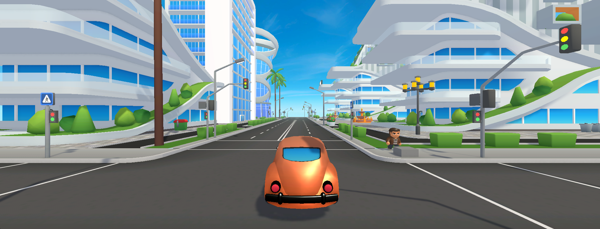
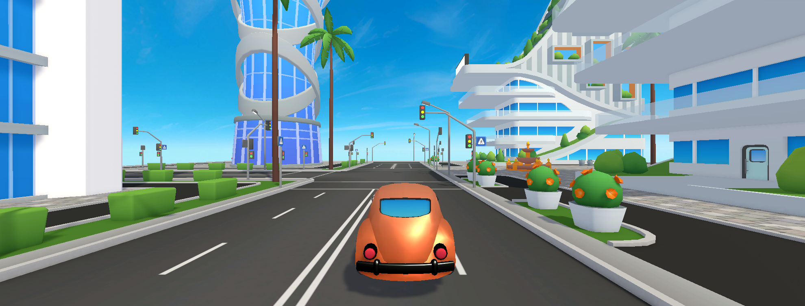

# 🚗 Cidade Futurista – Dirija o Fusca

## 🎮 Descrição do Jogo e Controles
Este é um jogo em terceira pessoa desenvolvido no Unity, ambientado em uma **cidade futurista** com pedestres.  
O objetivo é **dirigir um fusca clássico** pela cidade sem capotar, explorando os cenários e curtindo o passeio.

**Controles:**
- **W, A, S, D** → Movimentar o carro (acelerar, frear e virar)  
- **Espaço** → Freio de mão  

---

## 📖 História do Jogo
No ano de 2080, em meio a carros voadores e arranha-céus ultramodernos, um **fusca clássico sobreviveu ao tempo** e continua rodando pelas ruas da cidade futurista.  
Você é o motorista desse ícone e deve mostrar que, mesmo em meio à tecnologia de ponta, **a tradição nunca morre**.  
Seu desafio é **explorar a cidade sem capotar**, desviando de pedestres e curtindo o passeio pelas ruas iluminadas do futuro.

---

## 📹 Vídeo do Jogo em Execução (Gameplay)
👉 [Assista ao gameplay aqui](https://drive.google.com/file/d/10Z4Adp-t4Xrn0UzOQ8JeJi5qMNLxsQRC/view?usp=sharing)  

---

## 🖼️ Prints do Jogo

  
  

